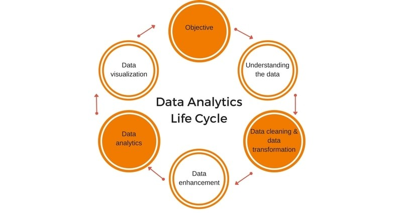

## **What does a Data scientist do?**

- Data mining and scrubbing.
- Statistical analysis of collected data.
- Training and developing machine learning models.
- Deploying machine learning models.
- Making predictions on new data.
- Data cleansing
- **Average Salary: $**90k above.
- **Data Science Tools:** SAS, Apache Spark, BigML, D3.js, MATLAB, Excel, Ggplot2, Tableau.

### Lifecycle of a Data Scientist

### **What does a Data analyst do?**

- Analyzing past and current trends.
- Data cleansing.
- Data visualization.
- Data analysis.
- Developing operational and financial reports.
- Interpreting data and communicating it clearly.
- **Average Salary: $**80k above.
- **Data Analyst tools:** Microsoft Power BI, SAP BusinessObjects, Sisense, TIBCO Spotfire, Thoughtspot, Qlik, SAS Business Intelligence, Tableau.

### Lifecycle of a Data Analyst
