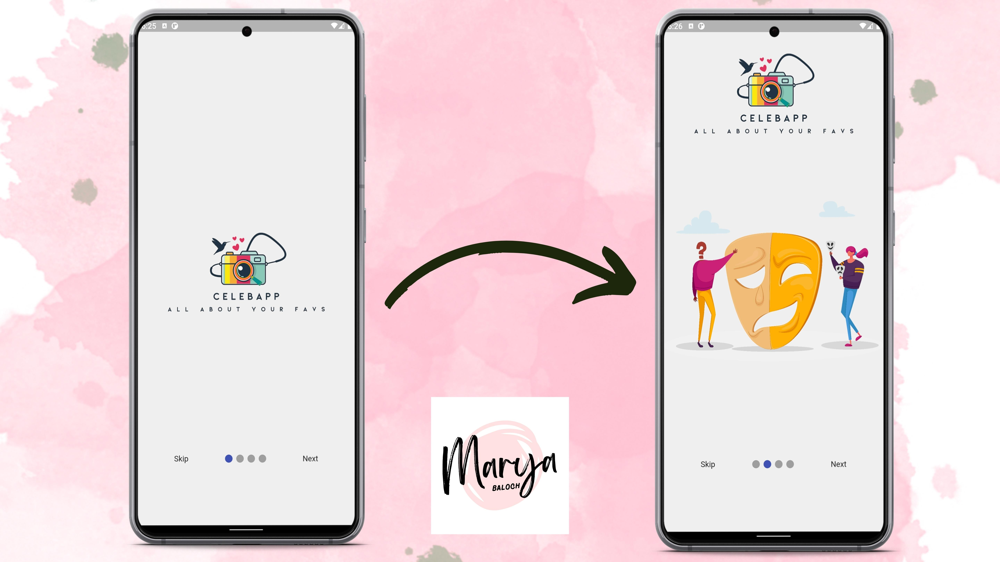

## Introduction Screens using Flutter



### Pageview Widget
In this section I'll discuss about pageview widget.
Pageview widget is a widget that allows you to swipe between pages.
Using Pageview widget you can create a scrollable list of pages.
Here is an example of pageview widget that I created:
```
 PageView(
            onPageChanged: (index) {
              setState(() {
                onLastPage = (index == 3);
              });
            },
            controller: _controller,
            children: const [
              LogoScreen(),
              IntroScreen1(),
              IntroScreen2(),
              IntroScreen3(),
            ],
          ), 
```
Here inside the Pageview I've included four screens, which are the children of the Pageview and a controller is also used.
I have also included a function that will be called when the page changes. This function will change the state of the onLastPage variable, when index is 3, the app will change the onLastPage variable to true.

### PageController
PageController is a class that allows you to control the current page of a PageView widget.
You can use the PageController to control the page of a PageView widget.
Here is an example of PageController:
``` final PageController _controller = PageController(); ```
Here I've created a **PageController variable called _controller**, And I used this _controller in some places in the code. I've used this _controller in the Pageview widget, and in the onPageChanged function, and in the onTap function.

```
GestureDetector(
                          onTap: () {
                            _controller.nextPage(
                                duration: const Duration(milliseconds: 500),
                                curve: Curves.easeIn);
                          },
                          child: const Text(
                            "Next",
                          )),
```
Here in the above code snipper I've used the **nextPage** function of the PageController to change the page to the next page.


```
GestureDetector(
                      onTap: () {
                        _controller.jumpToPage(3);
                      },
                      child: const Text("Skip")),
```
Here in the above code snippet I've used the **jumpToPage** function of the PageController to change the page to the third page, which is the last page.

### SmoothPageIndicator
SmoothPageIndicator is a widget that displays a set of dots to indicate the current page.
Here is an example of SmoothPageIndicator:
``` SmoothPageIndicator(controller: _controller, count: 4),```
Here I've created a **SmoothPageIndicator** widget and I've passed the **controller** and **count** variables to the widget. count is the number of pages in the Pageview widget. and controller is the PageController variable.
I've wrapped the SmoothPageIndicator widget in a row, and I've wrapped the row in a Container widget.

Here is an example of the code:
```//dot indicator | wraped in container for alignment
          Container(
              alignment: const Alignment(0, 0.75),
              child: Row(
                mainAxisAlignment: MainAxisAlignment.spaceEvenly,
                children: [
                  //Skip Button
                  GestureDetector(
                      onTap: () {
                        _controller.jumpToPage(3);
                      },
                      child: const Text("Skip")),

                  //Dot Indicator
                  SmoothPageIndicator(controller: _controller, count: 4),

                  //Next or Done button
                  onLastPage
                      ? GestureDetector(
                          onTap: () {
                            // Navigator.push(context, MaterialPageRoute(builder: (context) {return Homepage()}))
                          },
                          child: const Text("Done"))
                      : GestureDetector(
                          onTap: () {
                            _controller.nextPage(
                                duration: const Duration(milliseconds: 500),
                                curve: Curves.easeIn);
                          },
                          child: const Text(
                            "Next",
                          )),
                ],
              ),),
```
Here in the above code I've wrapped the SmoothPageIndicator widget in a row so that I can align the dots in the center of the screen, and add a skip button and a done/next button and then I wrapped the row in a Container widget to alligent the dots in the center of the screen.

### onLastPage
onLastPage is a variable that is used to determine if the user is on the last page of the Pageview widget.
Here is an example of onLastPage:
``` bool onLastPage = false; ```
Here I've created a **onLastPage** variable and I've set it to false.


Here is an example of the code:
```
onLastPage
                      ? GestureDetector(
                          onTap: () {
                            Navigator.push(context, MaterialPageRoute(builder: (context) {return Homepage()}))
                          },
                          child: const Text("Done"))
                      : GestureDetector(
                          onTap: () {
                            _controller.nextPage(
                                duration: const Duration(milliseconds: 500),
                                curve: Curves.easeIn);
                          },
                          child: const Text(
                            "Next",
                          )),
```
Here in the above code I've used the onLastPage, and if it is true, I've added a done button, else I've added a next button. which means if the user is on last page, a Done button will be displayed, else a Next button will be displayed.

### Screens
Here I've created four screens, which are the children of the Pageview widget.
Inside screens I've added images.
Here is code of First screen named as LogoScreen:
```
import 'package:flutter/material.dart';

class LogoScreen extends StatelessWidget {
  const LogoScreen({Key? key}) : super(key: key);

  @override
  Widget build(BuildContext context) {
    return Container(
      color: const Color(0xffefefef),
      child: const Center(
        child: Image(
          image: AssetImage("assets/images/logo_trans.png"),
        ),
      ),
    );
  }
}
```

In the same way I added images in other screens.